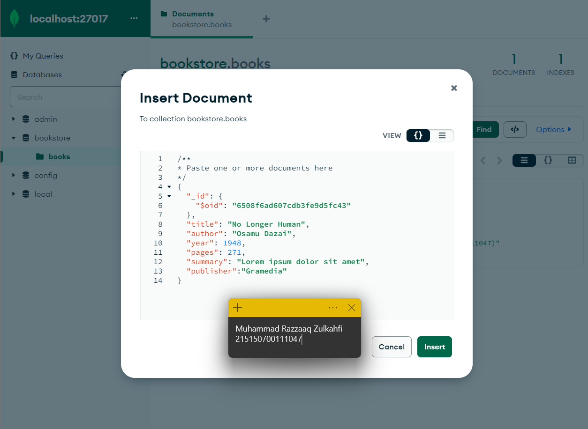

# Praktikum 02: CRUD MongoDB Compass dan Shell

_Nama: Muhammad Razzaaq Zulkahfi 
NIM: 215150700111047 
Kelas: Pemrograman Integratif-A_

## **Langkah Percobaan**

_MongoDB Compass_

1. Lakukan koneksi ke MongoDB menggunakan connection string   .png> "Koneksi ke MongoDB")

2. Buat database dengan melakukan klik “Create Database”  .png> "Create Database")

3. Lakukan insert buku pertama dengan melakukan klik “Add Data”, pilih “Insert Document”, isi dengan data yang diinginkan dan klik “Insert”  .png> "Insert Document") 

4. Lakukan insert buku kedua dengan cara yang sama.  .png> "Masukkan data ke 2")

5. Lakukan pencarian buku dengan author “Osamu Dazai" dengan mengisi filter yang diinginkan dan klik “Find”  .png> "Find Osamu Dazai")

6. Lakukan perubahan summary pada buku “No Longer Human” menjadi “Buku yang
   bagus (`<NAMA>,<NIM>`) dengan melakukan klik “Edit Document” (berlambang pensil), mengisi nilai summary yang baru, dan melakukan klik “Update”  .png> "Melakukan klik “Edit Document” ")

7. Lakukan penghapusan pada buku “I Am a Cat” dengan melakukan klik “Remove Document” (berlambang tong sampah) dan melakukan klik “Delete”  .png> "Penghapusan pada buku “I Am a Cat”")

_MongoDB Shell_

1. Lakukan koneksi ke MongoDB Server dengan menjalankan command mongosh bagi yang menggunakan terminal build in OS sehingga tampilan terminal kalian akan
   menjadi seperti berikut  .png> "Menjalankan command mongosh")

2. Mencoba melihat list database yang ada di server dengan menjalankan command _show dbs_  .png> "Melihat list database")
     
   Untuk berpindah ke database “bookstore” gunakan command _use bookstore_ , kalian dapat memastikan telah berpindah ke database yang benar dengan melihat tulisan sebelum tanda “>”  .png> "Berpindah ke database “bookstore”")
     Cobalah untuk melihat collection yang ada pada database tersebut dengan menggunakan command _show collections_  .png> "Melihat collection yang ada pada database ")

3. Lakukan insert buku “Overlord I” dengan menggunakan command
   db.books.insertOne(`<data kalian>`) , setelah insert buku berhasil maka MongoDB akan
   mengembalikan pesan sebagai berikut.  .png> "Lakukan insert buku “Overlord I”")

4. Lakukan insert buku “The Setting Sun” dan “Hujan” dengan insert many dengan menggunakan command db.books.insertMany(`<data kalian>`) , dan akan mengembalikan pesan sebagai berikut.  .png> "Lakukan insert buku “The Setting Sun” dan “Hujan” dengan insert many")

5. Lakukan pencarian buku dengan menggunakan command db.books.find() untuk melakukan pencarian semua buku.  .png> "pencarian buku")

6. Tampilkan seluruh buku dengan author “Osamu Dazai” dengan mengisi argument pada find() dengan menggunakan command db.books.find({`<filter yang ingin
diisi>`})  .png> "Tampilkan seluruh buku dengan author “Osamu Dazai”")

7. Lakukan perubahan summary pada buku “Hujan” menjadi “Buku yang bagus(`<NAMA>,<NIM>`) dengan mengunakan command `db.books.updateOne({<filter>}, {$set: {<data yang akan di update>}}) `sehingga output yang dihasilkan oleh MongoDB akan menjadi seperti berikut   .png> "Lakukan perubahan summary")

8. Lakukan perubahan publisher menjadi “Yen Press” pada semua buku “Osamu Dazai” dengan menggunakan command `db.books.updateMany({<filter>}, {$set: {<data yang akan di update>}})`  .png> "Lakukan perubahan publisher ")

9. Lakukan penghapusan pada buku “Overlord I” dengan menggunakan command `db.books.deleteOne({<argument>})`  .png> "Lakukan penghapusan pada buku")

10. Lakukan penghapusan pada semua buku “Osamu Dazai dengan menggunakan
    command `db.books.deleteMany({<argument>})`  .png> "Lakukan penghapusan pada semua buku")
