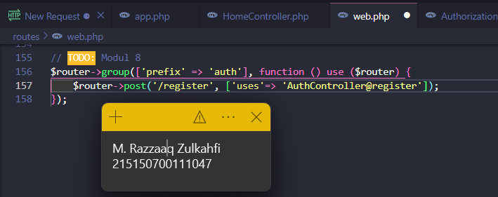

# Praktikum 07: Relasi One-to-Many dan Many-to-Many

###### Nama: Muhammad Razzaaq Zulkahfi<br>NIM: 215150700111047<br>Kelas: Pemrograman Integratif-A

# DASAR TEORI

## Authentication

Otentifikasi adalah proses untuk mengenali identitas dengan mekanisme
pengasosiasian permintaan yang masuk dengan satu set kredensial pengidentifikasi. Kredensial yang diberikan akan dibandingkan dengan database informasi pengguna yang berwenang di dalam sistem operasi lokal atau server otentifikasi.

## Token

Token merupakan nilai yang digunakan untuk mendapatkan akses ke sumber daya
yang dibatasi secara elektronik. Penggunaan token ditujukan pada web service yang tidak menyimpan state yang berkaitan dengan penggunaan aplikasi (stateless) seperti session.

## Authorization

Authorization merupakan proses pemberian hak istimewa yang dilakukan setelah
proses authentication. Setelah pengguna diidentifikasi pada proses authentication, authorization akan memberikan hak istimewa dan tindakan yang diizinkan kepada pengguna yang ditentukan.

## **Langkah Percobaan**

Menjalankan localhost dengan menjalankan :

```
php -S localhost:8000 -t public
```

# REGISTER

Berikut adalah tabel yang akan digunakan pada percobaan ini

> **#1**

Pastikan terdapat tabel users yang dibuat menggunakan migration pada bab 5
Basic Routing dan Migration . Berikut informasi kolom yang harus ada

| id        |
| --------- |
| createdAt |
| updatedAt |
| name      |
| email     |
| updatedAt |

> **#2**

Pastikan terdapat model User.php yang digunakan pada bab 5 Model, Controller dan Request-Response Handler. Berikut baris kode yang harus ada

```php
<?php

namespace App\Models;
use Illuminate\Database\Eloquent\Model;

class User extends Model
{
    /**
    * The attributes that are mass assignable.
    *
    * @var array
    */
    protected $fillable = [
    'name', 'email', 'password'
    ];
    /**
    * The attributes excluded from the model's JSON form.
    *
    * @var array
    */
    protected $hidden = [];
}
```

.png>)

> **#3**

Buatlah file AuthController.php dan isilah dengan baris kode berikut

```php
<?php
namespace App\Http\Controllers;

use App\Models\User;
use Illuminate\Http\Request;
use Illuminate\Support\Facades\Hash;

class AuthController extends Controller
{
    /**
    * Create a new controller instance.
    *
    * @return void
    */
    public function __construct()
    {
    //
    }
    //
    public function register(Request $request)
    {
        $name = $request->name;
        $email = $request->email;
        $password = Hash::make($request->password);
        $user = User::create([
            'name' => $name,
            'email' => $email,
            'password' => $password
        ]);
        return response()->json([
            'status' => 'Success',
            'message' => 'new user created',
            'data' => [
                'user' => $user,
            ]
        ],200);
    }
}

```

.png>)

> **#4**

Tambahkan baris berikut pada `routes/web.php`

```php
<?php
...
$router->group(['prefix' => 'auth'], function () use ($router) {
    $router->post('/register', ['uses'=> 'AuthController@register']);
});
```



> **#5**

Jalankan aplikasi pada endpoint `/auth/register` dengan body berikut

```json
{
  "name": "Scaramouche",
  "email": "scaramouche@fatui.org",
  "password": "wanderer"
}
```

.png>)

# AUTHENTICATION

> **#1**

Buatlah fungsi `login(Request $request)` pada file `AuthController.php`

```PHP
<?php
namespace App\Http\Controllers;

use App\Models\User;
use Illuminate\Http\Request;
use Illuminate\Support\Facades\Hash;

class AuthController extends Controller
{
    ...
    public function login(Request $request)
    {
        $email = $request->email;
        $password = $request->password;
        $user = User::where('email', $email)->first();
        if (!$user) {
            return response()->json([
                'status' => 'Error',
                'message' => 'user not exist',
            ],404);
        }
        if (!Hash::check($password, $user->password)) {
        return response()->json([
            'status' => 'Error',
            'message' => 'wrong password',
        ],400);
        }
        return response()->json([
            'status' => 'Success',
            'message' => 'successfully login',
            'data' => [
                'user' => $user,
            ]
        ],200);
    }
}
```

.png>)

.png>)

> **#2**

Tambahkan baris berikut pada `routes/web.php`

```PHP
<?php
...
$router->group(['prefix' => 'auth'], function () use ($router) {
    $router->post('/register', ['uses'=> 'AuthController@register']);
    $router->post('/login', ['uses'=> 'AuthController@login']); // route login
});
```

.png>)

> **#3**

Jalankan aplikasi pada endpoint `/auth/login` dengan body berikut

```json
{
  "email": "scaramouche@fatui.org",
  "password": "wanderer"
}
```

.png>)

Jika password atau username salah

.png>)

# TOKEN

> **#1**

Jalankan perintah berikut untuk membuat migrasi baru

```php
php artisan make:migration add_column_token_to_users
```

.png>)

> **#2**

Tambahkan baris berikut pada migration yang baru terbuat

```php
<?php
use Illuminate\Database\Migrations\Migration;
use Illuminate\Database\Schema\Blueprint;
use Illuminate\Support\Facades\Schema;
class AddColumnTokenToUsers extends Migration
{
    /**
    * Run the migrations.
    *
    * @return void
    */
    public function up()
    {
        Schema::table('users', function (Blueprint $table) {
            $table->string('token', 72)->unique()->nullable(); //
        });
    }
    /**
    * Reverse the migrations.
    *
    * @return void
    */
    public function down()
    {
        Schema::table('users', function (Blueprint $table) {
            $table->dropIfExists('token'); //
        });
    }
}
```

.png>)

> **#3**

Tambahkan atribut token di `$fillable` pada `User.php`

```php
<?php
namespace App\Models;
use Illuminate\Database\Eloquent\Model;
class User extends Model
{
    /**
    * The attributes that are mass assignable.
    *
    * @var array
    */
    protected $fillable = [
        'name', 'email', 'password',
    'token' //
    ];
    /**
    * The attributes excluded from the model's JSON form.
    *
    * @var array
    */
    protected $hidden = [];
}

```

.png>)

> **#4**

Tambahkan baris berikut pada file `AuthController.php`

```php
<?php
namespace App\Http\Controllers;

use App\Models\User;
use Illuminate\Http\Request;
use Illuminate\Support\Facades\Hash;
use Illuminate\Support\Str;

class AuthController extends Controller
{
...
public function login(Request $request)
{
    $email = $request->email;
    $password = $request->password;
    $user = User::where('email', $email)->first();
    if (!$user) {
        return response()->json([
            'status' => 'Error',
            'message' => 'user not exist',
        ],404);
    }
    if (!Hash::check($password, $user->password)) {
        return response()->json([
            'status' => 'Error',
            'message' => 'wrong password',
        ],400);
    }

    $user->token = Str::random(36); //
    $user->save(); //

    return response()->json([
        'status' => 'Success',
        'message' => 'successfully login',
        'data' => [
            'user' => $user,
        ]
    ],200);
    }
}


```

.png>)

> **#5**

Jalankan perintah di bawah untuk menjalankan migrasi terbaru

```php
php artisan migrate
```

.png>)

> **#6**

Jalankan aplikasi pada endpoint /auth/login dengan body berikut. Salinlah token
yang didapat ke notepad

```json
{
  "email": "scaramouche@fatui.org",
  "password": "wanderer"
}
```

.png>)

# AUTHORIZATION

> **#1**

Buatlah file `Authorization.php` pada folder `App/Http/Middleware` dan isilah dengan baris berikut

```PHP
<?php
namespace App\Http\Middleware;
use App\Models\User;
use Closure;
class Authorization
{
    /**
    * Handle an incoming request.
    *
    * @param \Illuminate\Http\Request $request
    * @param \Closure $next
    * @return mixed
    */
    public function handle($request, Closure $next)
    {
    $token = $request->header('token') ?? $request->query('token');
    if (!$token) {
        return response()->json([
            'status' => 'Error',
            'message' => 'token not provided',
        ],400);
    }
    $user = User::where('token', $token)->first();
    if (!$user) {
        return response()->json([
            'status' => 'Error',
            'message' => 'invalid token',
        ],400);
    }
    $request->user = $user;
    return $next($request);
    }
}
```

.png>)

> **#2**

Tambahkan middleware yang baru dibuat pada `bootstrap/app.php.`

```PHP
/*
|--------------------------------------------------------------------------
| Register Middleware
|--------------------------------------------------------------------------
|
| Next, we will register the middleware with the application. These can
| be global middleware that run before and after each request into a
| route or middleware that'll be assigned to some specific routes.
|
*/
// $app->middleware([
// App\Http\Middleware\ExampleMiddleware::class
// ]);
$app->routeMiddleware([
'auth' => App\Http\Middleware\Authorization::class, //
]);

```

.png>)

> **#3**

Buatlah fungsi `home()` pada `HomeController.php`

```PHP
<?php
namespace App\Http\Controllers;
use App\Models\User; // import model User
use Illuminate\Http\Request;
use Illuminate\Http\Response;
class HomeController extends Controller
{
    ...
    public function home(Request $request)
    {
    $user = $request->user;
    return response()->json([
        'status' => 'Success',
        'message' => 'selamat datang ' . $user->name,
    ],200);
    }
}
```

.png>)

> **#4**

Tambahkan baris berikut pada `routes/web.php`

```PHP
<?php

$router->get('/', ['uses' => 'HomeController@index']);
$router->get('/hello', ['uses' => 'HomeController@hello']);
$router->get('/home', ['middleware' => 'auth','uses' => 'HomeController@home']); //
```

.png>)

> **#5**

Jalankan aplikasi pada endpoint `/home` dengan melampirkan nilai **token** yang
didapat setelah login pada header.

.png>)
